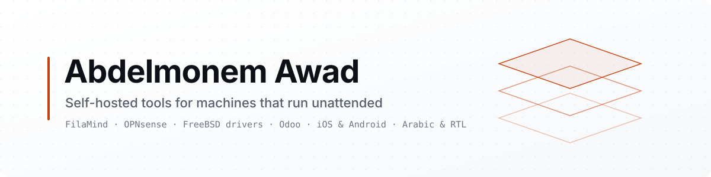
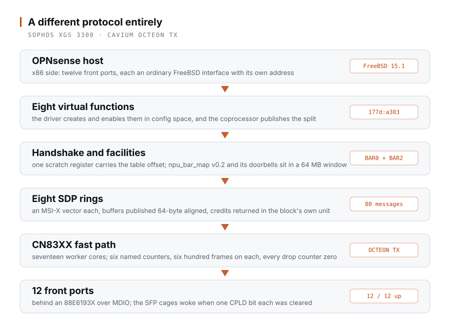
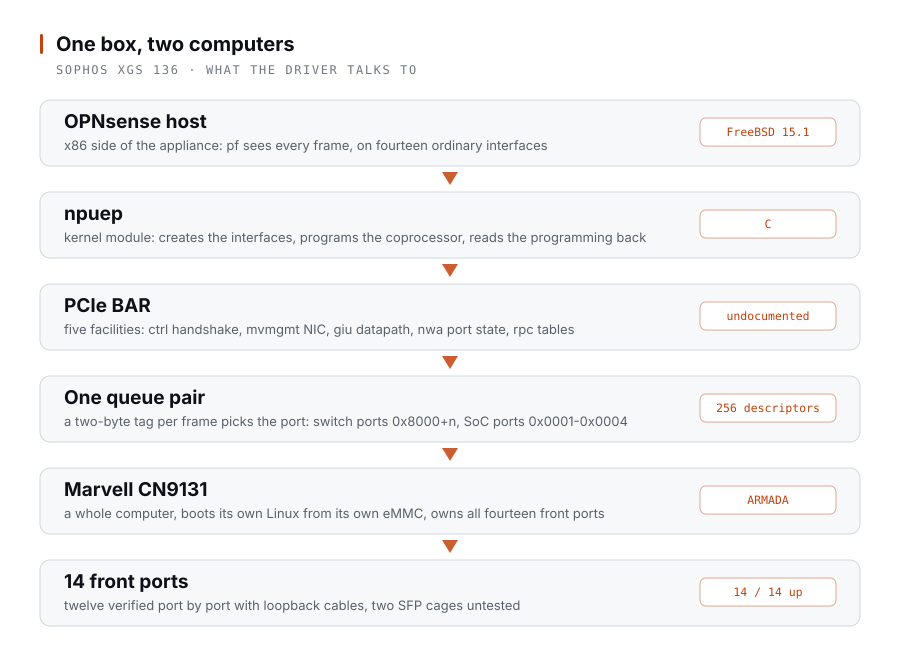
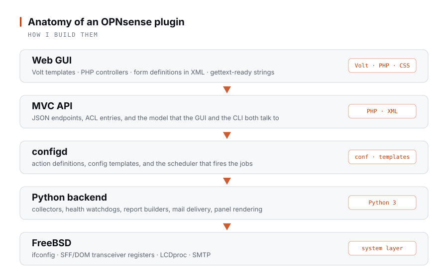

<picture>
  <source media="(prefers-color-scheme: dark)" srcset="assets/banner-dark.svg">
  <source media="(prefers-color-scheme: light)" srcset="assets/banner-light.svg">
  
</picture>

Hi, I'm Abdelmonem. I build self-hosted software for hardware that is supposed to look after itself — and, lately, drivers for hardware that refuses to be driven at all. Alongside that: a control suite for Klipper 3D printers, plugins for OPNsense firewalls, local LLM serving on Synology hardware, Odoo modules, and iOS and Android apps.

Most of it is Python and TypeScript. Almost all of it ships in Arabic as well as English, because the people running this hardware do not all read English.

## os-xgs-npu — reclaiming a family of firewalls

Install OPNsense on a Sophos XGS and it boots to a working firewall with **no network interfaces at all**. The appliance looks like one computer and is two: an x86 host, and a coprocessor behind a PCIe endpoint that owns every front port. Sophos ships drivers for Linux and for its own OS only, so when support lapses the usual verdict on the hardware is e-waste.

The point is not one rescued box. The XGS line spans six coprocessor families, which the vendor's own `xgs-host-startup.sh` tells apart by a single PCI id each — or, for the two families that carry no coprocessor at all, by a string in `/proc/cpuinfo`. Get the protocol right for one family and every assembly in it becomes a general-purpose FreeBSD router. Two of the six answer now, on silicon that shares nothing. That is a generation of appliances, not a machine.

| Family | Assemblies | Coprocessor | State |
| :--- | :--- | :--- | :--- |
| **OCTEON TX** | AMDA0202 (XGS 3300) | Cavium CN83XX | **Working** — twelve of twelve front ports, one of them carrying the appliance's WAN |
| **ARMADA** | AMDA0201 (XGS 126, 136), 0200, 0208, 0224 | Marvell CN9131 | **Working** — fourteen of fourteen front ports on the XGS 136 |
| **OCTEON TX2** | AMDA0203, 0204, 0225, 0228 | Cavium OCTEON TX2 | Described from the vendor's binaries; no hardware here |
| **OCTEON TX2 98XX** | AMDA0205, 0226 | Cavium OCTEON TX2 98XX | Described from the vendor's binaries; no hardware here |
| **TOPAZ**, **GR** | Atom boards | none | No coprocessor exists — nothing to drive |

**[os-xgs-npu](https://github.com/AbdelmonemAwad/os-xgs-npu)** holds the FreeBSD kernel modules that talk to them — `npuep` for Marvell, `octep` for Cavium — written against registers no vendor documents, and built on the appliance against its own kernel's headers.

> **The repository is much younger than the work in it.** Months of reverse engineering, measurement
> and dead ends on real appliances came before any of it went public, and one of the faults it closes
> had been open for eighteen of them.

### What works

Two families, on silicon that shares nothing — not the endpoint, not the datapath, not the way a port is named. The second is the larger piece of work.

**The XGS 3300** (Cavium OCTEON TX CN83XX) has all twelve front ports up as ordinary FreeBSD interfaces, each carrying its own address, and one of them is serving as the appliance's WAN. Frames entering a copper panel port arrive on the interface that owns it, and frames leave for machines off the appliance.

<picture>
  <source media="(prefers-color-scheme: dark)" srcset="assets/octeon-dark.svg">
  <source media="(prefers-color-scheme: light)" srcset="assets/octeon-light.svg">
  
</picture>

Little of that is shared with the Marvell side. The endpoint announces itself through a single scratch register whose high half says where the facility table lives; the host creates eight virtual functions and programs eight SDP rings, one MSI-X vector each, publishing receive buffers 64-byte aligned and returning credits in the unit the block actually takes. Behind the panel sits an 88E6193X switch that has to be reached over MDIO and programmed before a copper port will pass anything, and a port is bound by the tag the switch actually sends, which is not the number the coprocessor's agent calls it.

The whole loop closes, and it closes on the coprocessor's own evidence. With a fibre between the two SFP+ cages, six hundred frames posted on the host's ring come back through six of the fast path's named counters — taken off the ring, routed to the wire, transmitted, received on the other cage, forced to the host because no offloaded connection matched it, handed over — six hundred on every one, nothing dropped anywhere, and the driver's own test frame read back out of memory this host owns.

The two 1G cages had been dark the whole time for one bit each in CPLD register `0x25`. Their 10G neighbours' equivalents read clear, which is exactly why those two had always worked.

**The first numbers off it.** A UDP sender that never waits puts 525,722 packets a second into the driver, aimed at a panel port with no cable in it so nothing anyone else uses is touched. The coprocessor takes every one, chooses the wire for every one, and refuses 84% at its own egress queue — which is the correct thing for it to do. What leaves is 83,365 packets a second, **1,023 Mbit/s: line rate for a gigabit port** once the preamble and the interframe gap are counted. Nothing in the account is unexplained. Separately, thirty thousand full-size frames round-trip with no loss at all, averaging 0.193 ms — a latency figure, not a throughput one, and the repository says so rather than letting it be read as both.

**The XGS 136** (Marvell CN9131) came first, and all fourteen of its front ports carry traffic in both directions as interfaces created at boot with nothing typed. The module programs the coprocessor and reads the programming back before it trusts it.

<picture>
  <source media="(prefers-color-scheme: dark)" srcset="assets/npu-dark.svg">
  <source media="(prefers-color-scheme: light)" srcset="assets/npu-light.svg">
  
</picture>

Twelve of the fourteen are verified port by port with loopback cables rather than a single ARP exchange — an exchange with an outside device proves one path and says nothing about the other eleven. The port order came out of a disassembly and the loopback run confirmed it: a frame leaving `npup10` arrived on `npup9`, exactly where the disassembled table said it would, and the four SoC ports really are tagged out of connector order.

The result that matters for a firewall: while transmitting out of each port in turn, the sending port's own counter never moved. The coprocessor's internal switch does not forward between front ports behind the host's back, so `pf` is the only forwarder. Had it forwarded, traffic would pass between two ports without the firewall ever seeing it.

### Still open

The XGS 136's own SFP cage still waits on fibre. Beyond the network path, the appliance's peripherals are the open ground: its sensors sit on the second SMBus controller of the AMD FCH, which FreeBSD does not attach at all, and the front panel's protocol has been read out of the vendor's own daemon but not yet driven.

The two OCTEON TX2 families are read from the vendor's own fast-path binaries — which ship with symbols and DWARF — and from the BSP rootfs. They are described, not supported, and every row covering an assembly nobody here owns says so where it appears.

### Reading hardware nobody documents

Identity on these boards is decided twice over, and independently: the assembly part number selects the U-Boot image, while an MD5 hash of two DMI strings selects the model, the install target and the coprocessor firmware. The installer never reads a model name at all. If a board ever reports the wrong model, suspect DMI before suspecting hardware.

The vendor's own map has a defect worth knowing before trusting it: two AMDA0228 assemblies appear in two `case` arms, and a shell `case` takes the first match, so those two can never reach the image the second arm would give them. That script decides whether to reflash a coprocessor bootloader and with which image. It is a starting point, not an authority.

It is experimental, and the repository says so loudly: writing to an undocumented PCIe coprocessor from a kernel module of my own making has wedged the bench hard enough to need a power cycle by hand, more than once. Run it on nothing you depend on.

## FilaMind — Klipper and Moonraker

[FilaMind](https://github.com/filamind-app) is an open-source, self-hosted suite for makers running Klipper and Moonraker. Most of my commits over the past year went here.

- **[filamind-core](https://github.com/filamind-app/filamind-core)** — the TypeScript foundation the rest is built on: a Moonraker client, a session orchestrator, a fail-closed write arbiter so two front ends can never fight over the same printer, and i18n for 19 locales.
- **[filamind-flow](https://github.com/filamind-app/filamind-flow)** — the control panel: firmware flashing, input shaping, TMC motor-driver tooling. Python and FastAPI behind Vue 3, built one widget at a time so each piece can be adopted on its own.
- **[filamind-screen](https://github.com/filamind-app/filamind-screen)** — the on-printer touch interface, same core, wrapped as a desktop app with Tauri 2.
- **[filamind-3d](https://github.com/filamind-app/filamind-3d)** — the web control UI on top of the core. Vue 3, Vite and Tailwind over a lean FastAPI host.
- **[filamind-ai](https://github.com/filamind-app/filamind-ai)** — private AI for a Synology NAS: local LLM chat with optional cloud fallback, multi-user, an OpenAI-compatible API, and a full interface in both Arabic and English. Runs on a DVA 3221 with its CUDA GPU, or a DS1821+ on CPU.
- **[filamind-setup](https://github.com/filamind-app/filamind-setup)** — one installer engine behind two front ends, a CLI and a widget inside flow.

## OPNsense plugins

Four plugins, BSD-2 licensed like the platform itself and packaged as FreeBSD ports.

- **[os-linkhealth](https://github.com/AbdelmonemAwad/os-linkhealth)** — watches every physical port and names the cable or transceiver that is going bad, by the label printed on the chassis rather than the interface name. It reads the DOM registers on the transceivers, so the warning arrives before the link actually drops.
- **[os-netreport](https://github.com/AbdelmonemAwad/os-netreport)** — scheduled network reports by email, and an alert the first time an unknown device shows up. Each report is written in whichever language the GUI is set to.
- **[os-frontpanel](https://github.com/AbdelmonemAwad/os-frontpanel)** — drives the LCD and buttons built into an appliance's front panel through LCDproc, with the screens and their timing set from the GUI instead of a config file on disk.
- **[os-fanctl](https://github.com/AbdelmonemAwad/os-fanctl)** — fan control and every readable temperature sensor, for repurposed appliances whose fan curve left with the vendor firmware. Talks to the Super I/O chip directly.

They share one shape:

<picture>
  <source media="(prefers-color-scheme: dark)" srcset="assets/stack-dark.svg">
  <source media="(prefers-color-scheme: light)" srcset="assets/stack-light.svg">
  
</picture>

Volt templates and PHP for the interface, the model in XML, configd actions in the middle, and Python doing the real work against FreeBSD. Following that layout instead of inventing my own is what lets the plugins get backed up, upgraded and translated like every other part of the system.

## Odoo

Most of my Odoo work is client projects in private repositories: custom modules and business integrations. The public part is the device side, where Odoo has to talk to real hardware.

- **[filamind-iot](https://github.com/deltafabs/filamind-iot)** — a self-hosted IoT gateway addon for Odoo 19, paired with the IoT-box image below.
- **[filamind-iotbox](https://github.com/deltafabs/filamind-iotbox)** — a patched Odoo IoT Box image that takes a server URL directly on its settings page, instead of going through the hosted pairing service.
- **[filamind-iot-proxy](https://github.com/deltafabs/filamind-iot-proxy)** — the replacement for that hosted service: pairing rendezvous, ACME certificate issuer and reverse-tunnel relay, LGPL and running on your own machine.

## Arabic and right-to-left

- **[opnsense-arabic](https://github.com/AbdelmonemAwad/opnsense-arabic)** — the Arabic translation of the OPNsense 26.7 web interface, tracked against upstream so the strings don't drift between releases.
- **[opnsense-rtl](https://github.com/AbdelmonemAwad/opnsense-rtl)** — right-to-left layout for Arabic and Persian. Flipping the text direction is the easy half; tables, form flow, icon direction, menu alignment and a long tail of Bootstrap overrides are what decide whether an RTL interface is genuinely usable or merely mirrored.

The same concern runs through everything else: 19 locales in filamind-core, Arabic and English throughout filamind-ai, and every OPNsense report rendered in the language of whoever has to read it.

## cadenza

**[cadenza](https://github.com/AbdelmonemAwad/cadenza)** curates music libraries on a Synology NAS: acoustic fingerprinting to find real duplicates, metadata pulled from several sources, format conversion. It never deletes anything. Suspect files go to quarantine, because a false positive should cost you a folder, not a recording. DSM 7, x86_64.

## Not on this page

A fair amount of my work stays in private repositories: the Odoo projects built on top of the modules above, and iOS and Android applications. Ask if that is the part you need.

## What I use

Python for backends, plugins and media pipelines. TypeScript and Vue 3 for every FilaMind front end, React on cadenza. PHP and Volt because that is what an OPNsense interface is written in. Rust where a Tauri shell needs it, and C for the kernel-side work: the XGS driver, the Super I/O access in the fan controller, and the local inference build in filamind-ai.

Underneath: FreeBSD and its ports tree, Synology DSM 7, Docker, FastAPI, Vite, Tailwind, gettext, and GitHub Actions for CI and releases. At the hardware end: SFP/SFF DOM registers, HD44780 panels through LCDproc, TMC stepper drivers, and CUDA when there is a GPU worth using.

Happy to talk about Klipper tooling, OPNsense plugins, FreeBSD, local LLM serving, or Arabic localization of infrastructure software.

## Recently shipped

<!-- releases starts -->
- [**cadenza** v2.11.4-0036](https://github.com/AbdelmonemAwad/cadenza/releases/tag/v2.11.4-0036) — 15 Sep 2026
- [**filamind-3d** v0.2.1](https://github.com/filamind-app/filamind-3d/releases/tag/v0.2.1) — 23 Jul 2026
- [**filamind-screen** v0.18.1](https://github.com/filamind-app/filamind-screen/releases/tag/v0.18.1) — 23 Jul 2026
- [**filamind-core** v0.1.6](https://github.com/filamind-app/filamind-core/releases/tag/v0.1.6) — 23 Jul 2026
- [**filamind-flow** v1.25.2](https://github.com/filamind-app/filamind-flow/releases/tag/v1.25.2) — 23 Jul 2026
- [**filamind-ai** v1.4.1](https://github.com/filamind-app/filamind-ai/releases/tag/v1.4.1) — 30 May 2026
<!-- releases ends -->

<!-- Fill this in and remove the comment markers to show it on the profile:

-->
